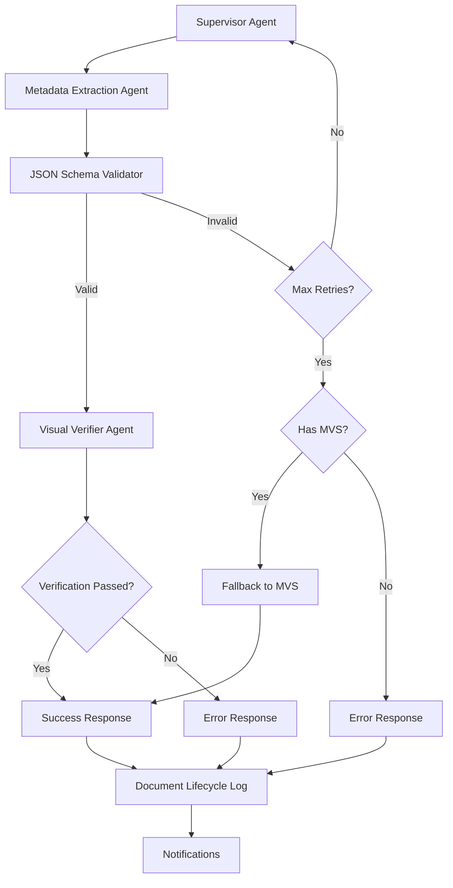

# V1 Linear Flow with Enhanced Verification – Intelligent Materials Intake System

This enhanced version of V1 implements improved verification with JSON schema validation and visual PDF verification.

## Enhanced Flow Summary

```
Supervisor → Metadata Extractor → Schema Validator → Visual Verifier → Response
```



## Enhanced Verification Features

The verification process has been split into two complementary stages:

1. **JSON Schema Validation**:
   - Validates structure and format of extracted metadata
   - Checks required fields, array formats, and value patterns
   - Provides specific error information for retry requests
   - Implements retry logic for extraction failures
   - Falls back to MVS only after multiple failed attempts

2. **Visual Verification**:
   - Verifies extracted data against the original PDF
   - Uses multimodal LLM capabilities to locate data in the document
   - Provides confidence adjustments based on verification results
   - Identifies hallucinated or incorrect data
   - Produces evidence of verification with page and location information

## Retry Logic

When JSON schema validation fails:
1. The system logs specific validation errors
2. Metadata extraction is retried with error context
3. The retry prompt includes guidance on previous failures
4. After a maximum of 3 attempts, the system either:
   - Falls back to MVS if available
   - Fails the process completely if MVS is not available

## Configuration

### Schema Validator

The schema validator configuration is in `schema_validator.js` and can be adjusted for different validation requirements. Key settings include:

- Required fields: `name`, `brand`, `category`, `dimensions`
- MVS fields: `name`, `dimensions`, `brand`, `summary`
- Maximum retry attempts: 2
- Fallback confidence threshold: 0.7

### Visual Verifier

The visual verifier configuration is in the LLM prompt and function implementation. Key features:

- Fields to visually verify: `name`, `brand`, `dimensions`, `category`, `certifications`
- Confidence adjustment based on verification results
- Evidence collection with page numbers and locations

## Implementation Notes

1. This enhancement preserves backward compatibility
2. The JSON schema validation runs before the more expensive LLM verification
3. Visual verification is skipped for invalid or fallback schemas
4. Detailed evidence is provided in the final output for auditing
5. The system maintains a complete document lifecycle log for all state transitions

## Usage

Deploy using the standard V1 deployment process. The schema validator will be automatically inserted into the workflow.