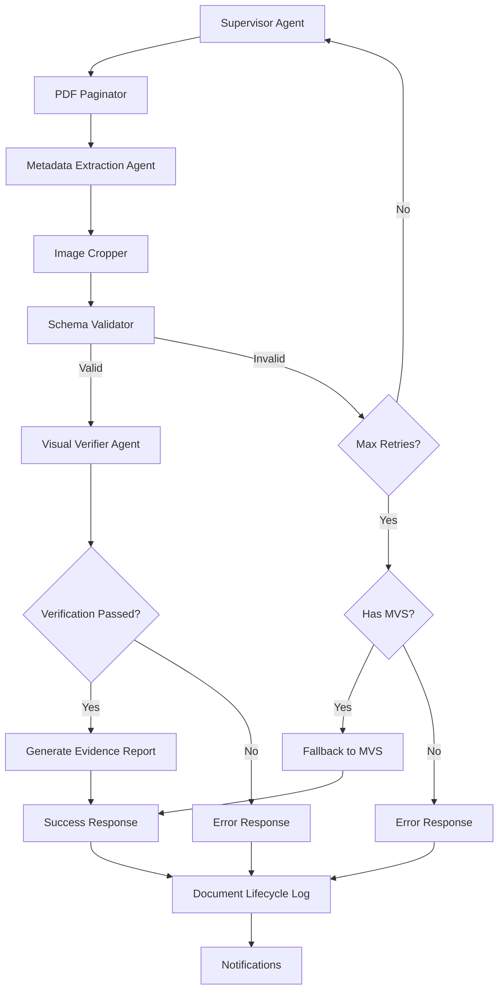

# V1 Linear Flow – Intelligent Materials Intake System

This version represents the production-ready implementation of the IMIS pipeline with enhanced verification capabilities.

## Flow Summary

```
Supervisor → PDF Paginator → Metadata Extractor (with coordinates) → Image Cropper → Schema Validator → Visual Verifier → Response
```



## Production-Ready Features

- ✅ **Complete n8n workflow** with error handling and monitoring
- ✅ **Two-stage verification** with JSON schema and visual PDF checks
- ✅ **Visual coordinate extraction** for precise field location
- ✅ **PDF pagination and image cropping** for targeted verification
- ✅ **Evidence report generation** with verification details
- ✅ **Retry logic** for extraction failures with guided prompts
- ✅ **Confidence-based fallback** to Minimum Viable Schema (MVS)
- ✅ **Enhanced webhook handler** with proper error handling and security
- ✅ **Comprehensive logging** with document lifecycle tracking
- ✅ **Environment configuration** for deployment flexibility
- ✅ **Testing script** for validation and quality assurance
- ✅ **Deployment documentation** for production environments

## Enhanced Verification Features

The verification process uses a visual-aware approach with coordinates and image crops:

1. **PDF Pagination and Coordinate Extraction**:
   - Converts PDFs to individual page images
   - Extracts metadata with precise coordinates [x1, y1, x2, y2]
   - Records page numbers for each extracted field
   - Enables targeted verification of specific regions

2. **Image Cropping**:
   - Generates crops of each extracted field
   - Creates visual evidence for verification
   - Enables field-by-field visual confirmation
   - Preserves context for later review

3. **Schema Validation**:
   - Validates structure and format of extracted metadata
   - Checks required fields, array formats, and value patterns
   - Provides specific error information for retry requests
   - Implements retry logic for extraction failures
   - Falls back to MVS only after multiple failed attempts

4. **Visual Verification**:
   - Verifies extracted data against crops of specific regions
   - Uses multimodal LLM capabilities to confirm extracted text
   - Provides confidence adjustments based on verification results
   - Identifies hallucinated or incorrect data
   - Produces evidence of verification with page and location information

5. **Evidence Reporting**:
   - Generates HTML evidence report with verification details
   - Shows verification status for each field
   - Includes confidence scores and page numbers
   - Provides audit trail of verification process

## Confidence Policy Implementation

The system implements a three-tier confidence policy:

1. **Trust threshold** (confidence ≥ 0.9): Full schema extraction
2. **Fallback threshold** (0.7 ≤ confidence < 0.9): Minimum Viable Schema (MVS)
3. **Failure threshold** (confidence < 0.7): Rejection with detailed reasons

When falling back to MVS, the system preserves the following essential fields:
- `name`: Material name
- `dimensions`: Material dimensions
- `brand`: Brand name
- `summary`: Brief description

## Retry Logic

When JSON schema validation fails:
1. The system logs specific validation errors
2. Metadata extraction is retried with error context
3. The retry prompt includes guidance on previous failures
4. After a maximum of 3 attempts, the system either:
   - Falls back to MVS if available
   - Fails the process completely if MVS is not available

## Agent Interface Contracts

All agents follow strict interface contracts for reliable communication:

1. **Supervisor → Metadata Extraction Agent**: Initiates extraction with document context
2. **Metadata Extraction Agent → Schema Validator**: Provides extracted metadata
3. **Schema Validator → Visual Verifier/Supervisor**: Routes based on validation results
4. **Visual Verifier → Supervisor**: Reports verification with evidence and confidence adjustment

## Deployment Quick Start

1. Install dependencies (including image processing libraries):
   ```
   pip install flask requests python-dotenv werkzeug pdf2image pillow
   apt-get install poppler-utils  # Required for PDF processing
   ```

2. Configure environment settings in `.env` file (copy from env-template.txt)
   ```
   cp deployment/env-template.txt .env
   nano .env  # edit as needed
   ```

3. Create required directories:
   ```
   mkdir -p storage/pages storage/crops logs
   chmod 755 storage logs storage/pages storage/crops
   ```

4. Start the webhook handler:
   ```
   python webhook_handler.py
   ```

5. Import the enhanced workflow into n8n:
   ```
   n8n import:workflow --input=deployment/workflow_Materials_Intake_Enhanced.json
   ```

6. Test the deployment:
   ```
   python testing_script.py
   ```

For detailed deployment instructions, see [DEPLOYMENT.md](DEPLOYMENT.md).

> Note: The legacy workflow (`workflow_Materials_Intake_FullFlow.json`) is still available but lacks the enhanced visual verification features.

## System Requirements

- Python 3.8+
- poppler-utils (for PDF processing)
- n8n instance
- SMTP/IMAP server access
- Vision-capable LLM API access (OpenAI, Gemini Vision, or Claude 3)

## Logging and Monitoring

The system provides comprehensive logging and monitoring:

- Document lifecycle tracking in JSON format
- Structured logs with rotation
- Health check endpoint (`/health`)
- Document status tracking (`/status/<document_id>`)
- Slack notifications for processing status

## Configuration

The configuration is managed through:

1. **Environment Variables**:
   - Email settings (SMTP/IMAP)
   - LLM API configuration
   - Storage paths 
   - Logging options

2. **Schema Validator** (`schema_validator.js`):
   - Required fields: `name`, `brand`, `category`, `dimensions`
   - MVS fields: `name`, `dimensions`, `brand`, `summary`
   - Maximum retry attempts: 2
   - Fallback confidence threshold: 0.7

3. **Visual Verifier** (in prompts and functions):
   - Fields to verify: `name`, `brand`, `dimensions`, `category`, `certifications`
   - Confidence adjustment mechanism
   - Evidence collection with page numbers and locations

## Security Considerations

- All inputs are validated and sanitized
- File uploads are restricted to PDFs
- Secure filename handling to prevent path traversal
- Rate limiting for API endpoints
- Environment variables for sensitive credentials

## License

MIT License — see [`LICENSE.txt`](LICENSE.txt)