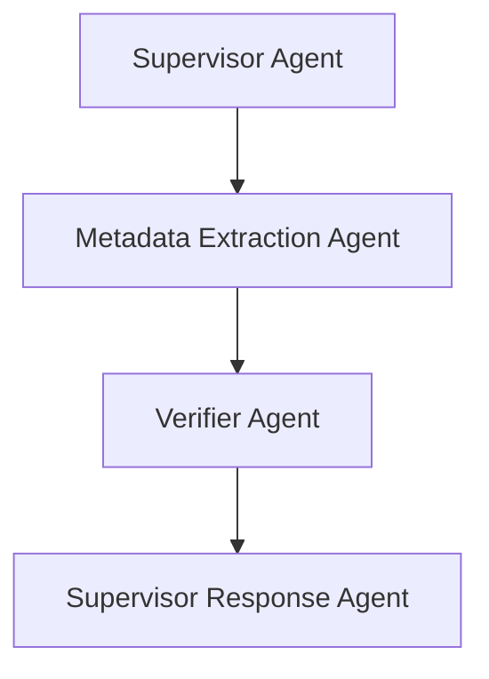

# V1 Linear Flow – Intelligent Materials Intake

This version represents the first functional pipeline prototype with a simple, linear agent chain.

## Flow Summary

Supervisor → Metadata Extractor → Verifier → Response

## Post-Patch Additions

- ✅ ConfidenceEnvelope-based fallback to MVS
- ✅ Prompt metadata (prompt_id, model_version)
- ✅ DocumentLifecycleLog logging
- ✅ Manual feedback support