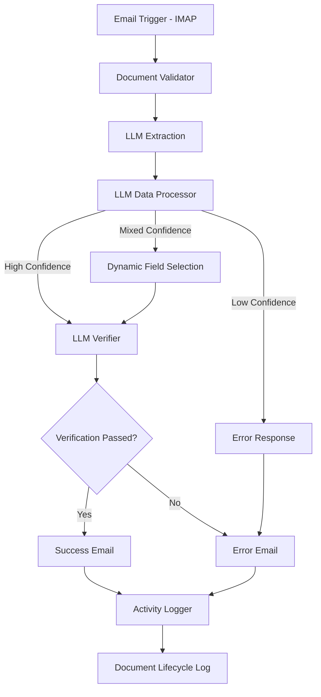

# V1 Linear Flow – Email-based Multimodal Materials Intake System

This implementation provides an email-based document processing pipeline using n8n workflow automation and multimodal LLM capabilities for extracting materials metadata from PDF attachments, supporting both single and multiple products per document.

## Architecture Overview

```
Email (IMAP) → Document Validation → LLM Extraction → Data Processing → Verification → Email Response
```



## Key Features

- ✅ **Email-based ingestion** via IMAP monitoring
- ✅ **Direct PDF processing** with multimodal LLM
- ✅ **Multiple product extraction** from single documents
- ✅ **Visual extraction** with confidence scores and coordinates
- ✅ **Intelligent data processing** with dynamic field selection
- ✅ **Multimodal verification** against original document
- ✅ **Partial success support** for multi-product documents
- ✅ **Automated email responses** with extracted metadata
- ✅ **Comprehensive logging** of document lifecycle

## Deployment Architecture

The system runs as a single n8n container with volume-mounted functions and prompts:

1. **n8n Workflow Engine**: Orchestrates the entire pipeline
2. **Volume Mounts**: Provides access to functions and prompts
3. **Email Integration**: IMAP for ingestion, SMTP for responses
4. **LLM APIs**: External services for extraction and verification

## Quick Start

1. **Configure Environment**:
   ```bash
   cp env-template.txt .env
   # Edit .env with your email and LLM API credentials
   ```

2. **Deploy with Docker**:
   ```bash
   docker-compose up -d
   ```

3. **Import Workflow**:
   - Access n8n at http://localhost:5678
   - Import `workflow_Materials_Intake_V1.json`
   - Configure email credentials
   - Activate the workflow

4. **Test the System**:
   - Send an email with PDF attachment to your IMAP inbox
   - System processes and responds with extracted metadata

For detailed deployment instructions, see [DEPLOYMENT.md](DEPLOYMENT.md).

## System Components

### Core Files
- `docker-compose.yml`: n8n deployment configuration
- `workflow_Materials_Intake_V1.json`: n8n workflow definition
- `scripts/document_validator.js`: Document validation function
- `scripts/success_notifier.js`: Success email formatting function
- `scripts/error_notifier.js`: Error email formatting function  
- `prompts/llm_*.txt`: LLM prompt templates for each node

### Directory Structure
```
V1_Linear_Flow/
├── docker-compose.yml          # Docker deployment
├── .env                        # Environment configuration (created from env-template.txt)
├── data/                       # n8n data directory (auto-created by Docker)
│   └── logs/                   # Activity logs (auto-created)
├── scripts/                    # Core functions (mounted read-only)
│   ├── document_validator.js   # Document validation function
│   ├── success_notifier.js     # Success email formatter
│   └── error_notifier.js       # Error email formatter
├── prompts/                    # LLM prompts (mounted read-only)
│   ├── llm_extraction.txt      # Prompt for LLM Extraction node
│   ├── llm_data_processor.txt  # Prompt for LLM Data Processor node
│   └── llm_verifier.txt        # Prompt for LLM Verifier node
├── email_templates/            # Email templates (mounted read-only)
│   ├── success.txt             # Success email template
│   └── failure.txt             # Failure email template
├── workflow_Materials_Intake_V1.json
├── DEPLOYMENT.md
└── env-template.txt
```

## Configuration

### Environment Variables
Configure these in your `.env` file:

```env
# Email Settings
IMAP_HOST=imap.example.com
IMAP_PORT=993
SMTP_HOST=smtp.example.com
SMTP_PORT=587
EMAIL_USER=materials@example.com
EMAIL_PASS=your-password

# LLM API Settings
LLM_API_KEY=your-api-key
LLM_API_ENDPOINT=https://generativelanguage.googleapis.com/v1beta/models/gemini-2.0-flash:generateContent
```

### Volume Mounts
The Docker setup mounts these directories into n8n:
- `./scripts:/home/node/scripts:ro` - Processing functions
- `./prompts:/home/node/prompts:ro` - LLM prompts
- `./email_templates:/home/node/email_templates:ro` - Email templates
- `./data:/home/node/data` - n8n data and logs (directory auto-created by Docker)

## Processing Pipeline

1. **Email Trigger**: Monitors IMAP inbox for new emails
2. **Document Validator**: Validates PDF attachments
3. **LLM Extraction**: Extracts metadata using vision model
4. **Data Processor**: Assesses quality and confidence
5. **LLM Verifier**: Verifies extracted data
6. **Email Response**: Sends results back to sender
7. **Activity Logger**: Records lifecycle events

## Confidence Policy

The system implements a three-tier confidence policy per product:
- **High (≥0.9)**: Full schema extraction
- **Mixed (0.7-0.9)**: Dynamic field selection
- **Low (<0.7)**: Rejection with explanation

For multi-product documents:
- Each product is evaluated independently
- Document succeeds if at least one product passes validation
- Partial success is supported and reported

## Development & Maintenance

### Workflow Node Type Changes
The workflow uses Code nodes instead of Function nodes for better reliability and maintainability:
- **Document Validator**: Code node that processes incoming emails and validates PDF attachments
- **Success Notifier**: Code node that formats successful extraction emails
- **Error Notifier**: Code node that formats error notification emails
- **Activity Logger**: Code node that logs document lifecycle events

### Updating Functions
Edit files in `scripts/` directory - changes apply immediately without restart:
- `document_validator.js`: For PDF validation logic
- `success_notifier.js`: For success email formatting
- `error_notifier.js`: For error email formatting

The workflow references these scripts, but now processes them directly in Code nodes rather than Function nodes. The workflow no longer loads these scripts using `runInNewContext`.

### Updating Prompts
Edit files in `prompts/` directory - changes apply immediately.

### Updating Email Templates
Edit files in `email_templates/` directory - changes apply immediately:
- `email_templates/success.txt`: Template for successful extraction emails
- `email_templates/failure.txt`: Template for error notification emails

### Modifying Workflow
1. Edit in n8n UI
2. Export workflow
3. Save to `workflow_Materials_Intake_V1.json`

## Logging & Monitoring

- **Activity Logs**: `./data/logs/document_lifecycle.json`
- **n8n Executions**: View in n8n UI
- **Docker Logs**: `docker-compose logs -f n8n`

## Email Customization

Email templates can be customized without modifying code:
- **Success Email**: Edit `email_templates/success.txt`
- **Error Email**: Edit `email_templates/failure.txt`

Templates support placeholders (e.g., `{{sender}}`, `{{productCount}}`) that are automatically replaced with actual values.

## Troubleshooting

See [DEPLOYMENT.md](DEPLOYMENT.md) for common issues and solutions.

## PROJECT_SPEC
```spec
NAME: Materials Library Extraction V1 - Email Pipeline
DOMAIN: Document Processing / Workflow Automation
PRIMARY_TOOLS: n8n, Docker, LLM APIs
PIPELINE_STAGES:
  1. Email ingestion via IMAP
  2. PDF validation
  3. Multimodal LLM extraction (single or multiple products)
  4. Confidence-based data processing per product
  5. Visual verification per product
  6. Email notification with all extracted products
KEY_COMPONENTS:
- `workflow_Materials_Intake_V1.json`: n8n workflow definition
- `scripts/*.js`: Individual function files for each processing node
- `prompts/llm_*.txt`: LLM prompt templates for each node
- `docker-compose.yml`: Deployment configuration
TECHNICAL_SPECIFICATIONS:
- `specs/`: Architecture and interface contracts
  - Confidence policies
  - Multi-product handling
  - Agent communication protocols
DESIGN_CONSTRAINTS:
- Email-based ingestion only
- Functions and prompts loaded via volume mounts
- Single n8n container deployment
- Direct PDF processing without conversion
- Products always handled as arrays (even single products)
- Supports partial success for multi-product documents
```