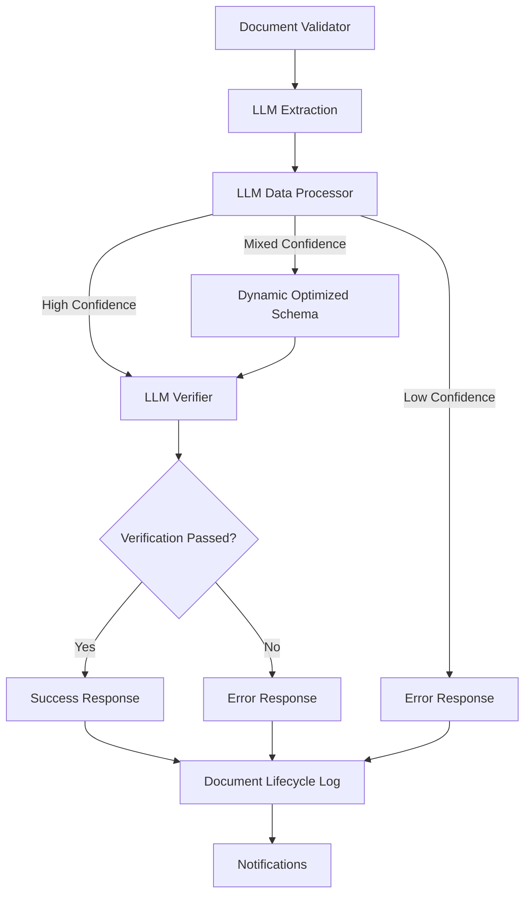

# V1 Linear Flow – Enhanced Multimodal Intelligent Materials Intake System

This version represents the enhanced implementation of the IMIS pipeline with multimodal extraction and intelligent LLM-based data processing capabilities.

## Flow Summary

```
Document Validator → LLM Extraction → LLM Data Processor → LLM Verifier → Response
```



## Multimodal Features

- ✅ **Direct PDF processing** with multimodal LLM capabilities
- ✅ **Visual extraction** with field locations and confidence
- ✅ **Intelligent LLM-based data processing** with dynamic field selection
- ✅ **Multimodal verification** against original document
- ✅ **Enhanced confidence scoring** with field-level metrics
- ✅ **Dynamic MVS optimization** prioritizing high-quality fields
- ✅ **Full comprehensive schema support** with [materials_schema.json](../materials_schema.json)

## Key Enhancements

1. **Streamlined Processing**:
   - Eliminates separate text extraction step
   - Processes PDFs directly using multimodal LLM
   - Maintains the same workflow structure with fewer components
   - Direct integration between LLM Extraction and Data Processing

2. **Improved Visual Context**:
   - Extracts field locations with page numbers and coordinates
   - Uses visual context for enhanced verification
   - Preserves layout and design information from documents

3. **Dynamic MVS Approach**:
   - Core MVS fields: `name`, `brand`, `summary`
   - LLM-based quality assessment of all extracted fields
   - Intelligent selection of optimal high-confidence field subset
   - Semantic understanding of field relationships and dependencies

4. **Enhanced Confidence Assessment**:
   - Field-level confidence metrics
   - Weighted scoring that prioritizes important fields
   - Semantic coherence evaluation
   - Quality-driven decision making

## Intelligent Data Processing

The system uses an LLM-based data processor that implements a sophisticated field selection strategy:

1. **Comprehensive Schema**:
   - Extracts metadata according to the standardized comprehensive [materials schema](../materials_schema.json)
   - Preserves field-level confidence scores and locations
   - Processes all available fields from the document

2. **LLM-Based Assessment**:
   - Evaluates extracted fields based on confidence, relationships, and utility
   - Makes context-aware decisions based on document quality
   - Implements confidence policy with adaptive thresholds
   - Provides explanatory notes about assessment decisions

3. **Dynamic Field Selection**:
   - When confidence is mixed (0.7-0.9), selects optimal field subset
   - Retains all fields with confidence ≥ 0.7
   - Prioritizes semantically coherent combinations
   - Preserves field relationships and dependencies

## Confidence Policy Implementation

The system implements a three-tier confidence policy with intelligent assessment:

1. **Trust threshold** (confidence ≥ 0.9): Proceed with full schema extraction
2. **Fallback threshold** (0.7 ≤ confidence < 0.9): Dynamic selection of high-confidence fields
3. **Failure threshold** (confidence < 0.7): Rejection with detailed reasons

See [CONFIDENCE_POLICY.txt](specs/CONFIDENCE_POLICY.txt) for detailed implementation.

## Agent Interface Contracts

The enhanced multimodal implementation updates the interface contracts:

1. **Document Validator → LLM Extraction**: Validates PDF and initiates processing
2. **LLM Extraction → LLM Data Processor**: Provides extraction with visual coordinates and confidence
3. **LLM Data Processor → LLM Verifier**: Routes optimized field set based on quality assessment
4. **LLM Verifier → Response Formatter**: Reports verification status with visual evidence

See [AGENT_INTERFACE_CONTRACTS.txt](specs/AGENT_INTERFACE_CONTRACTS.txt) for detailed contract specifications.

## Deployment Quick Start

1. Set up multimodal LLM API access in your environment file:
   ```
   LLM_VISION_API_ENDPOINT=https://api.provider.com/v1/models/vision-model
   LLM_VISION_MODEL=provider-vision-model
   LLM_TEXT_API_ENDPOINT=https://api.provider.com/v1/models/text-model
   LLM_TEXT_MODEL=provider-text-model
   ```

2. Import the workflow into n8n:
   ```
   n8n import:workflow --input=deployment/workflow_Materials_Intake_V1.json
   ```
   
   Note: The workflow file is named `workflow_Materials_Intake_V1.json` in this implementation.

3. Test the implementation:
   ```
   node scripts/test_llm_processor.js
   ```

4. Process a sample PDF:
   ```
   python scripts/testing_script.py --samples /path/to/pdf/file.pdf
   ```

For detailed deployment instructions, see [DEPLOYMENT.md](deployment/DEPLOYMENT.md).

## System Requirements

- Python 3.8+
- Node.js 14+
- n8n instance
- SMTP/IMAP server access
- Multimodal LLM API access (Gemini Vision, GPT-4V, or Claude 3)
- Text LLM API access (Gemini, GPT-4, or Claude)

## Configuration

The configuration includes enhanced settings:

1. **Environment Variables**:
   - Standard email and logging settings
   - Multimodal and text LLM API configuration
   - Model selection options

2. **V1 LLM Prompts**:
   - LLM Extraction: [metadata_extraction.txt](prompts/metadata_extraction.txt) - Multimodal extraction with visual coordinates
   - LLM Data Processor: [data_processor.txt](prompts/data_processor.txt) - Confidence-based field selection
   - LLM Verifier: [metadata_verification.txt](prompts/metadata_verification.txt) - Visual verification against original document

3. **Implementation Files**:
   - Enhanced functions: [functions_multimodal.js](scripts/functions_multimodal.js)
   - Test script: [test_llm_processor.js](scripts/test_llm_processor.js)

## Pipeline Optimizations

The V1 Linear Flow has been optimized to remove the redundant Metadata Parser component:
- Transformation logic integrated directly into LLM Extraction node
- Direct connection between extraction and data processing
- Simplified pipeline with fewer components
- Preserved all functionality including lifecycle management and error handling

Additional improvements:
- Enhanced guidance for handling multiple products in a single document
- Eliminated duplicate storage of field location data (DRY principle)
- Added "contains_multiple_products" flag to indicate when secondary products are present

## V1-Specific Implementation Files

- Core processing logic: [functions_multimodal.js](scripts/functions_multimodal.js)
- Main test script: [test_llm_processor.js](scripts/test_llm_processor.js)
- Webhook handler: [webhook_handler.py](scripts/webhook_handler.py)
- Agent prompts:
  - [metadata_extraction.txt](prompts/metadata_extraction.txt)
  - [data_processor.txt](prompts/data_processor.txt)
  - [metadata_verification.txt](prompts/metadata_verification.txt)