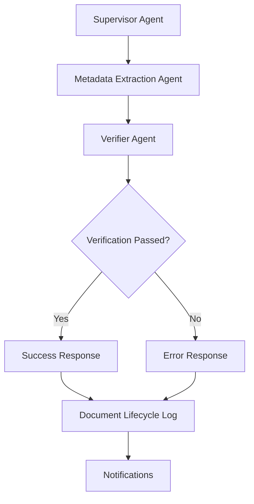

# V1 Linear Flow – Intelligent Materials Intake System

This version represents the production-ready implementation of the IMIS pipeline with a linear agent chain.

## Flow Summary

```
Supervisor → Metadata Extractor → Verifier → Response
```



## Production-Ready Features

- ✅ **Complete n8n workflow** with error handling and monitoring
- ✅ **Confidence-based fallback** to Minimum Viable Schema (MVS)
- ✅ **Enhanced webhook handler** with proper error handling and security
- ✅ **Comprehensive logging** with document lifecycle tracking
- ✅ **Environment configuration** for deployment flexibility
- ✅ **Testing script** for validation and quality assurance
- ✅ **Deployment documentation** for production environments

## Confidence Policy Implementation

The system implements a three-tier confidence policy:

1. **Trust threshold** (confidence ≥ 0.9): Full schema extraction
2. **Fallback threshold** (0.7 ≤ confidence < 0.9): Minimum Viable Schema (MVS)
3. **Failure threshold** (confidence < 0.7): Rejection with detailed reasons

When falling back to MVS, the system preserves the following essential fields:
- `name`: Material name
- `dimensions`: Material dimensions
- `brand`: Brand name
- `summary`: Brief description

## Agent Interface Contracts

All agents follow strict interface contracts for reliable communication:

1. **Supervisor → Metadata Extraction Agent**: Initiates extraction with document context
2. **Metadata Extraction Agent → Verifier Agent**: Provides structured metadata with confidence
3. **Verifier Agent → Supervisor**: Reports verification status with cleaned data or error reasons

## Deployment Quick Start

1. Configure environment settings in `.env` file
2. Start the webhook handler:
   ```
   python webhook_handler.py
   ```
3. Import the workflow into n8n:
   ```
   n8n import:workflow --input=workflow_Materials_Intake_FullFlow.json
   ```
4. Test the deployment:
   ```
   python testing_script.py
   ```

For detailed deployment instructions, see [DEPLOYMENT.md](DEPLOYMENT.md).

## System Requirements

- Python 3.8+
- n8n instance
- SMTP/IMAP server access
- LLM API access (OpenAI, Gemini, or Anthropic)

## Logging and Monitoring

The system provides comprehensive logging and monitoring:

- Document lifecycle tracking in JSON format
- Structured logs with rotation
- Health check endpoint (`/health`)
- Document status tracking (`/status/<document_id>`)
- Slack notifications for processing status

## Configuration

All system settings are managed through environment variables:

- Email settings (SMTP/IMAP)
- LLM API configuration
- Storage paths
- Logging options
- Notification settings

See the `.env` template for all available options.

## Security Considerations

- All inputs are validated and sanitized
- File uploads are restricted to PDFs
- Secure filename handling to prevent path traversal
- Rate limiting for API endpoints
- Environment variables for sensitive credentials

## License

MIT License — see [`LICENSE.txt`](LICENSE.txt)
