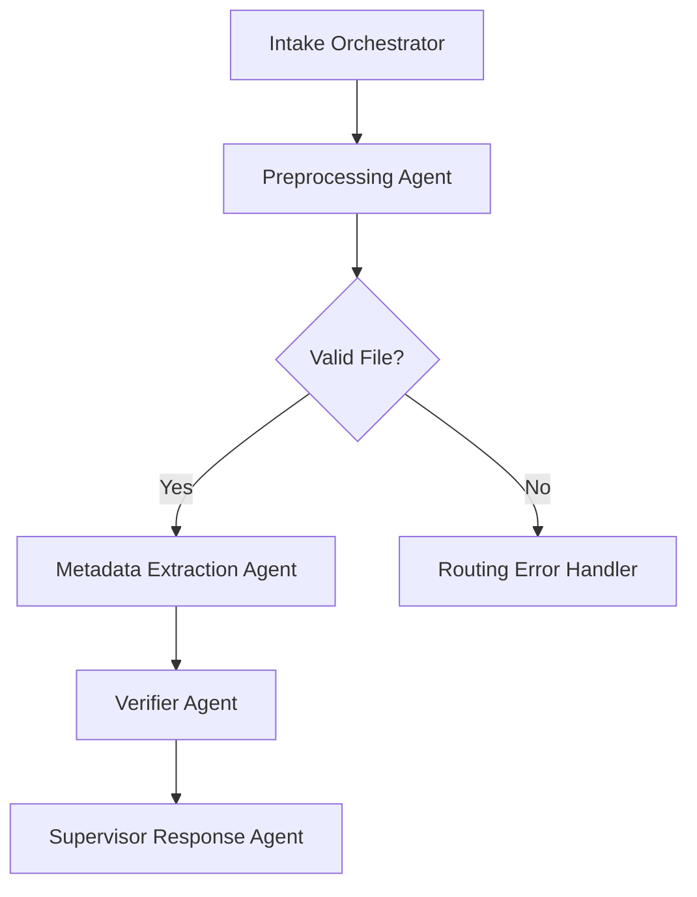

# V2 Modular Expansion – Intelligent Materials Intake System (IMIS)

This version introduces modular agent design with observability and fallback logic.

## Workflow

## Features

- Asynchronous orchestration
- Fallback logic (CE-driven)
- Prompt versioning
- Feedback loop support
- DocumentLifecycleLog enabled