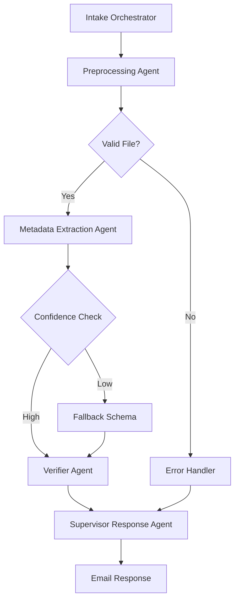

# V2 Modular Expansion – Intelligent Materials Intake System

This version introduces production-ready modular agent design with enhanced observability, robust fallback logic, and comprehensive feedback mechanisms.

## Architecture Overview



## Production-Ready Features

- ✅ **Modular Agent Architecture**: Clear separation of concerns with well-defined interfaces
- ✅ **Confidence Envelope**: Advanced confidence scoring with fallback mechanisms
- ✅ **Prompt Versioning**: Complete tracking of prompt versions and model specifications
- ✅ **Enhanced Document Lifecycle**: Comprehensive state tracking and history
- ✅ **Feedback Loop**: User feedback integration for continuous improvement
- ✅ **Production Configuration**: Environment variable management and security controls
- ✅ **Rate Limiting**: Protection against abuse with IP-based rate limiting
- ✅ **Structured Logging**: JSON-formatted logs for easier monitoring and analysis
- ✅ **Graceful Error Handling**: Comprehensive error management across the pipeline
- ✅ **Testing Suite**: Complete testing framework for quality assurance

## Confidence Envelope Implementation

The system features a sophisticated confidence evaluation mechanism:

- **Trust Threshold** (confidence ≥ 0.9): Full schema extraction
- **Fallback Threshold** (0.7 ≤ confidence < 0.9): Fallback to MVS
- **Failure Threshold** (confidence < 0.7): Rejection with detailed reasons

The Confidence Envelope (CE) is evaluated at multiple stages:
1. Initial document quality assessment
2. Extraction confidence calculation
3. Verification validation

## Interface Contracts

V2 implements strict interface contracts between agents:

1. **Intake Orchestrator → Preprocessing Agent**: Document metadata with file hash
2. **Preprocessing → Metadata Extraction**: Document quality assessment
3. **Metadata Extraction → Verifier**: Structured metadata with confidence envelope
4. **Verifier → Supervisor Response**: Validation report with detailed field assessments

## Deployment Quick Start

1. Configure environment settings in `.env` file (use `.env.example` as template)
2. Start the webhook handler:
   ```
   python webhook_handler.py
   ```
3. Import the workflow into n8n:
   ```
   n8n import:workflow --input=deployment/workflow_Materials_Intake_V2.json
   ```
4. Test the deployment:
   ```
   python testing_script.py
   ```

## Security Enhancements

V2 includes significant security improvements:

- Environment variables for all sensitive data
- Security headers for all HTTP responses
- Rate limiting for API protection
- PDF validation to prevent malicious files
- SHA-256 file hashing for integrity verification
- Secure path handling to prevent traversal attacks

## Feedback Loop

Users can submit corrections to processed documents:

```json
POST /feedback/v2/{document_id}
{
  "corrections": {
    "brand": "Corrected Brand",
    "dimensions": "2400x1200 mm"
  },
  "comment": "Dimensions were incorrect in the original document"
}
```

The system processes and stores feedback, enabling:
- Manual review of problematic documents
- Continuous improvement of extraction quality
- Tracking of common error patterns

## System Requirements

- Python 3.8+
- n8n instance
- SMTP/IMAP server access
- LLM API access (OpenAI, Gemini, or Anthropic)

## Advanced Configuration Options

The `.env` file supports extensive configuration options:

- Model selection and API endpoints
- Confidence threshold tuning
- Storage path customization
- Notification channels
- Performance tuning

## Monitoring and Observability

The system provides comprehensive monitoring capabilities:

- `/health` endpoint for system health checks
- `/status/v2/{document_id}` for document tracking
- Structured logging in JSON format
- Document lifecycle tracking
- Performance metrics

## License

MIT License — see [`LICENSE.txt`](LICENSE.txt)
