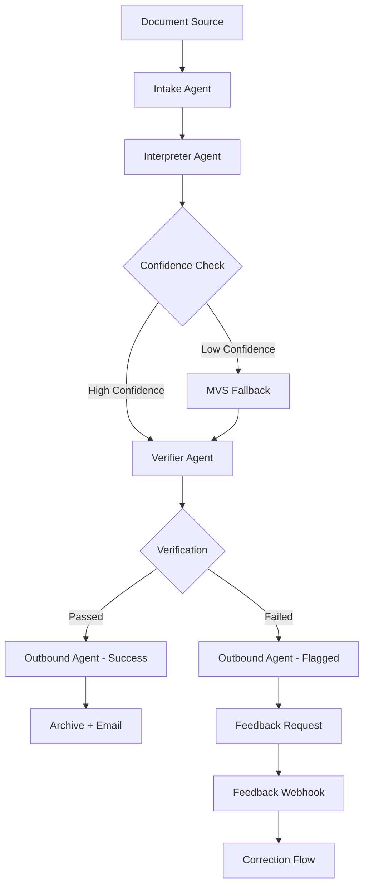

# V3 Intent-Driven Minimalism

Production-grade IMIS pipeline using intent-routing, confidence envelopes, and stateless-by-default design principles.

## Architecture Overview

The V3 architecture represents a fundamental evolution in the IMIS pipeline, focusing on intent detection, adaptive confidence handling, and stateless processing:



## Production-Ready Features

- ✅ **Intent-Driven Processing**: Document interpretation based on detected document type
- ✅ **Confidence Envelope (CE)**: Sophisticated confidence scoring with adaptive responses
- ✅ **Stateless-by-Default Design**: Components operate independently with minimal shared state
- ✅ **Comprehensive Feedback Loop**: Full integration of user corrections
- ✅ **Asynchronous Processing**: Background processing for better responsiveness
- ✅ **Enhanced Security**: API key authentication, rate limiting, and input validation
- ✅ **Complete Observability**: Structured logging and comprehensive state tracking
- ✅ **Robust Error Handling**: Graceful failure modes with informative responses
- ✅ **Production Configuration**: Comprehensive environment settings

## Core Components

### 1. Intake Agent
Receives documents via webhook or email, processes document metadata, and initiates the extraction pipeline with a standardized MaterialExtractionRequest (MER).

### 2. Interpreter Agent
Analyzes document content to extract structured metadata, detects layout patterns, and assigns confidence scores.

### 3. Verifier Agent
Validates extracted metadata against schema and semantic expectations, generates detailed field-level validation reports.

### 4. Outbound Agent
Delivers results to users via email with appropriate feedback mechanisms based on verification status.

## Confidence Envelope Implementation

The V3 system uses a sophisticated confidence scoring system with multiple thresholds:

- **Trust Threshold (≥0.9)**: Full extraction with standard verification
- **Fallback Threshold (0.7-0.89)**: Reduced to Minimum Viable Schema (MVS)
- **Failure Threshold (<0.7)**: Processing flagged for human review

Every document includes a Confidence Envelope (CE) that tracks:
- Overall extraction confidence
- Status indicator (`ok`, `uncertain`, or `fail`)
- Layout signature with confidence score
- Field-level confidence indicators

## Intent-Driven Processing

V3 makes intelligent decisions based on document characteristics:

1. **Document Type Detection**: Categorizes incoming documents (Datasheet, Catalogue, etc.)
2. **Layout-Aware Extraction**: Adapts extraction strategy based on detected layout patterns
3. **Language Sensitivity**: Supports multi-language documents with appropriate processing
4. **Adaptive Response**: Matches processing complexity to document quality

## Feedback System

The system includes a comprehensive feedback mechanism:

- Feedback requests are generated for uncertain or failed extractions
- Users can submit corrections via a structured API
- Corrections are integrated back into the extraction pipeline
- Each document carries a feedback token for secure attribution

## Deployment Quick Start

1. Configure environment settings in `.env` file (use `.env.example` as template)
2. Start the webhook handler:
   ```
   python webhook_handler.py
   ```
3. Import the workflow into n8n:
   ```
   n8n import:workflow --input=workflow_intent_driven.json
   ```
4. Test the deployment:
   ```
   python testing_script.py
   ```

## API Endpoints

The V3 system exposes several REST endpoints:

- **POST /v3/webhook**: Submit documents for processing
- **POST /v3/feedback/:request_id**: Submit feedback for a processed document
- **GET /v3/status/:request_id**: Check document processing status
- **GET /v3/metadata/:request_id**: Retrieve processed metadata
- **GET /health**: System health check

## Security Enhancements

V3 includes comprehensive security features:

- API key authentication for all endpoints
- Rate limiting to prevent abuse
- Input validation and sanitization
- Secure file handling and storage
- Comprehensive error handling

## Monitoring and Observability

The system provides extensive monitoring capabilities:

- Structured JSON logging for easier analysis
- Complete document lifecycle tracking
- Field-level validation reporting
- Detailed performance metrics
- Health checks with component status

## System Requirements

- Python 3.8+
- n8n instance (v0.214.0+)
- SMTP/IMAP server access
- LLM API access (OpenAI, Gemini, or Anthropic)

## License

MIT License — see [`LICENSE.txt`](LICENSE.txt)
