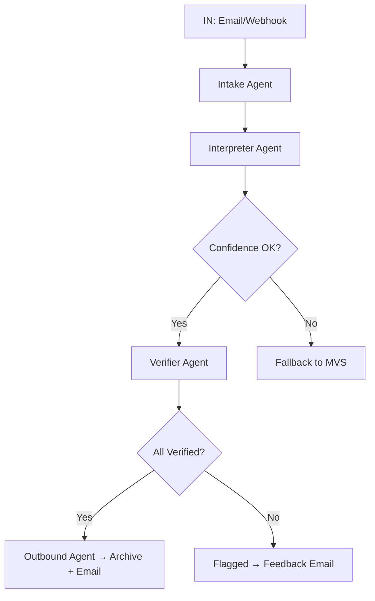

# V3 – Intent-Driven Minimalism

Production-grade IMIS pipeline using intent-routing, fallback logic, and modular prompts.

## Flow Diagram

## Highlights

- CE scoring and fallback routing
- Prompt versioning metadata
- Audit trail via DocumentLifecycleLog
- Stateless-by-default, state-aware-by-design