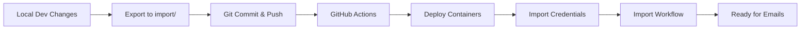

# V0 Initial Flow - Deployment Guide

Email-to-extraction pipeline with **export/import pattern** for automated CI/CD deployment.

## 🏗️ Architecture

**Email → PDF extraction → LLM metadata → Send results**

Request-response email service:
1. User sends email with PDF attachments to configured address
2. Bot extracts materials metadata from PDFs using Gemini AI
3. Bot emails structured results back to the original sender

## 📋 Prerequisites

- Docker & Docker Compose
- Email provider with IMAP/SMTP access
- Google Gemini API key
- VPS/server for production deployment (optional)

## 🚀 Local Development

### 1. Environment Setup
```bash
# Copy environment template
cp .env.template .env

# Edit .env with your credentials:
# - IMAP_HOST, IMAP_PORT, EMAIL_USER, EMAIL_PASS
# - SMTP_HOST, SMTP_PORT  
# - LLM_API_KEY (Gemini API key)
# - LLM_API_ENDPOINT
```

### 2. Launch
```bash
# Build and start n8n with mounted volumes
docker compose up -d

# Check logs
docker compose logs -f n8n
```

### 3. Configure n8n Workflow (One-time Setup)
1. Open http://localhost:5678
2. Create IMAP credentials with your email settings
3. Create SMTP credentials with your email settings
4. Import the workflow (copy/paste JSON or use import)
5. Link credentials to workflow nodes
6. Test with sample email + PDFs
7. **Export everything for deployment:**
   ```bash
   # Export credentials
   docker exec v0_initial_flow-n8n-1 n8n export:credentials --all --output=/home/node/import/credentials.json
   
   # Export workflow (get ID from n8n UI or list command)
   docker exec v0_initial_flow-n8n-1 n8n export:workflow --id=YOUR_WORKFLOW_ID --output=/home/node/import/workflows.json
   ```

### 4. Commit Export Files
```bash
git add import/credentials.json import/workflows.json
git commit -m "Update exported n8n configuration"
```

## 🏭 Production Deployment

### Automated CI/CD (Recommended)

**Deployment Strategy:**
Uses the **export/import pattern** following n8n community best practices:
- Development environment exports working credentials and workflows
- Export files stored in `import/` folder in Git
- CI/CD imports both to production, preserving UUIDs and relationships

**Prerequisites:**
- GitHub repository with Actions enabled
- VPS with Docker installed
- GitHub Secrets configured

**Setup GitHub Secrets:**
```
DEPLOY_HOST=your-server-ip
DEPLOY_SSH_KEY=your-private-key
EMAIL_USER=your-email@domain.com
EMAIL_PASS=your-app-password
LLM_API_KEY=your-gemini-api-key
```

**Deploy:**
```bash
# Any commit to v0_initial_flow branch triggers deployment
git checkout v0_initial_flow
git add import/  # Include updated export files
git commit -m "Deploy to production"
git push origin v0_initial_flow
```

**Server Setup (one-time):**
```bash
# On your VPS
sudo mkdir -p /opt/materials-archive-extraction
cd /opt/materials-archive-extraction
git clone https://github.com/your-username/materials-archive-extraction.git .
git checkout v0_initial_flow
sudo chown -R ubuntu:ubuntu /opt/materials-archive-extraction
```

### Manual Deployment

```bash
# On your VPS
cd /opt/materials-archive-extraction/v0_initial_flow
git checkout v0_initial_flow
git pull origin v0_initial_flow

# Set environment variables and deploy
EMAIL_USER="your-email" \
EMAIL_PASS="your-password" \
LLM_API_KEY="your-api-key" \
docker compose up -d --build

# Import credentials and workflow
docker exec v0_initial_flow-n8n-1 n8n import:credentials --input=/home/node/import/credentials.json
docker exec v0_initial_flow-n8n-1 n8n import:workflow --input=/home/node/import/workflows.json
```

## 🧪 Testing

### Automated Tests
```bash
# Install dependencies
cd tests
npm install

# Test LLM extraction directly
node test-extraction.js

# Test full email pipeline
node test-email.js

# Check latest received email
node check-latest-email.js
```

### Manual Testing
1. Send email with PDF attachment to configured address
2. Monitor n8n executions at http://localhost:5678
3. Check response email in your inbox
4. Verify extracted metadata format

## 📊 Monitoring & Operations

### Logs
```bash
# Application logs
docker compose logs -f n8n

# Structured debug logs (if configured)
tail -f data/debug.log | jq .
```

### Health Checks
```bash
# Check n8n health
curl http://localhost:5678/healthz

# Check container status
docker compose ps
```

### Restart/Update
```bash
# Restart services
docker compose restart n8n

# Update and rebuild
git pull origin v0_initial_flow
docker compose up -d --build

# Stop all services
docker compose down
```

## 🔧 Configuration

### Environment Variables
```bash
# Email Configuration
IMAP_HOST=imap.hostinger.com
IMAP_PORT=993
SMTP_HOST=smtp.hostinger.com
SMTP_PORT=465
EMAIL_USER=bot@yourdomain.com
EMAIL_PASS=your-app-password

# LLM Configuration  
LLM_API_ENDPOINT=https://generativelanguage.googleapis.com/v1beta/models/gemini-2.0-flash:generateContent
LLM_API_KEY=your-gemini-api-key
```

### File Structure
```
v0_initial_flow/
├── import/                             # Exported n8n configuration
│   ├── credentials.json               # n8n credentials export
│   └── workflows.json                 # n8n workflow export
├── docker-compose.yml                 # Container orchestration
├── prompts/llm_extraction.txt         # LLM extraction prompt
├── schema/materials_schema.json       # Output validation schema
├── email_templates/                   # Response templates
│   ├── success.html                  # Success email template
│   └── failure.html                  # Error email template
├── tests/                            # Test suite
└── data/                            # Runtime data (auto-created)
    ├── database.sqlite              # n8n database
    └── debug.log                    # Application logs
```

## 🚨 Troubleshooting

| Issue | Solution |
|-------|----------|
| **Email not triggering workflow** | Check IMAP credentials, verify email in INBOX, check n8n logs |
| **Extraction fails** | Verify LLM_API_KEY, check PDF validity, review prompt configuration |
| **No response email** | Check SMTP credentials, verify sender email, check spam folder |
| **Port 5678 conflict** | Change port mapping in docker-compose.yml |
| **Git ownership errors** | Run `sudo chown -R ubuntu:ubuntu /opt/materials-archive-extraction` |
| **CI/CD deployment fails** | Check GitHub Secrets, verify server SSH access, review logs |
| **Schema validation errors** | Validate output against schema/materials_schema.json |
| **Import fails** | Check export files exist in import/ folder, verify n8n container health |
| **Credentials not working** | Re-export credentials from working dev environment |

## 🔄 Workflow Updates

### Making Changes
1. **Local Development**: Make changes in your local n8n instance
2. **Test Thoroughly**: Verify with sample emails and PDFs
3. **Export Updated Config**:
   ```bash
   # Export credentials (if changed)
   docker exec v0_initial_flow-n8n-1 n8n export:credentials --all --output=/home/node/import/credentials.json
   
   # Export workflow
   docker exec v0_initial_flow-n8n-1 n8n export:workflow --id=YOUR_WORKFLOW_ID --output=/home/node/import/workflows.json
   ```
4. **Deploy**: Commit and push to `v0_initial_flow` branch

### CI/CD Pipeline Flow


The pipeline ensures reliable deployments by using n8n's native export/import functionality, preserving all UUIDs and relationships automatically.
