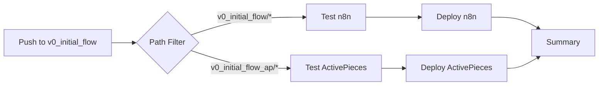

# V0 Initial Flow ActivePieces - Deployment Guide

Email-to-extraction pipeline using **ActivePieces** with automated CI/CD deployment.

## 🏗️ Architecture

**Email → PDF extraction → LLM metadata → Send results**

Request-response email service:
1. User sends email with PDF attachments to configured address
2. Bot extracts materials metadata from PDFs using Gemini AI
3. Bot emails structured results back to the original sender

## 📋 Prerequisites

- Docker & Docker Compose
- Email provider with IMAP/SMTP access
- Google Gemini API key
- VPS/server for production deployment (optional)

## 🚀 Local Development

### 1. Environment Setup
```bash
# Copy environment template
cp .env.template .env

# Edit .env with your credentials:
# - IMAP_HOST, IMAP_PORT, EMAIL_USER, EMAIL_PASS
# - SMTP_HOST, SMTP_PORT  
# - LLM_API_KEY (Gemini API key)
# - LLM_MODEL (e.g., gemini-2.0-flash)
```

### 2. Launch
```bash
# Build and start ActivePieces with mounted volumes
docker compose up -d

# Check logs
docker compose logs -f activepieces
```

### 3. Access ActivePieces
1. Open http://localhost:5679 (port 5679 to avoid conflict with n8n)
2. Create initial admin account
3. Import or create the workflow from `activepieces.json`
4. Test with sample email + PDFs

## 🏭 Production Deployment

### Automated CI/CD (Recommended)

**Deployment Strategy:**
Uses **path-based triggers** in a monorepo setup:
- Changes to `v0_initial_flow_ap/` directory trigger ActivePieces deployment
- Changes to `v0_initial_flow/` directory trigger n8n deployment
- Single GitHub Actions workflow handles both deployments intelligently

**Prerequisites:**
- GitHub repository with Actions enabled
- VPS with Docker installed
- GitHub Secrets configured (see below)

**Required GitHub Secrets:**
```
# Server Access
DEPLOY_HOST=your-server-ip
DEPLOY_SSH_KEY=your-private-key

# Email Configuration
IMAP_HOST=imap.hostinger.com
IMAP_PORT=993
SMTP_HOST=smtp.hostinger.com
SMTP_PORT=465
EMAIL_USER=your-email@domain.com
EMAIL_PASS=your-app-password

# LLM Configuration
LLM_API_KEY=your-gemini-api-key
LLM_MODEL=gemini-2.0-flash
```

**Deploy:**
```bash
# Any commit to v0_initial_flow branch that changes ActivePieces files triggers deployment
git add v0_initial_flow_ap/
git commit -m "Update ActivePieces workflow"
git push origin v0_initial_flow
```

**How Path-Based Deployment Works:**
1. Push to `v0_initial_flow` branch
2. GitHub Actions detects which directories changed
3. Runs tests only for changed components
4. Deploys only what changed (n8n, ActivePieces, or both)
5. Each deployment is independent

**Server Setup (one-time):**
```bash
# On your VPS
sudo mkdir -p /opt/materials-archive-extraction
cd /opt/materials-archive-extraction
git clone https://github.com/your-username/materials-archive-extraction.git .
git checkout v0_initial_flow
sudo chown -R ubuntu:ubuntu /opt/materials-archive-extraction
```

### Manual Deployment

```bash
# On your VPS
cd /opt/materials-archive-extraction/v0_initial_flow_ap
git pull origin v0_initial_flow

# Create .env file with your credentials
cp .env.template .env
# Edit .env with actual values

# Deploy
docker compose up -d --build

# Check status
docker compose ps
docker compose logs -f
```

## 🧪 Testing

### Debug Logging
The implementation includes comprehensive debug logging:
```bash
# Monitor debug logs
tail -f data/debug.log | jq .

# Check for attachment structure
tail -f data/debug.log | grep "attachment-debug"
```

### Manual Testing
1. Send email with PDF attachment to configured address
2. Monitor ActivePieces at http://localhost:5679
3. Check debug logs for processing details
4. Verify response email in your inbox

### Test Scripts
```bash
cd tests
# Run attachment debugger
node debug-attachments.js
```

## 📊 Monitoring & Operations

### Container Management
```bash
# View running containers
docker compose ps

# Check container logs
docker compose logs -f activepieces
docker compose logs -f postgres
docker compose logs -f redis

# Restart services
docker compose restart activepieces

# Stop all services
docker compose down

# Remove all data and start fresh
docker compose down -v
```

### Health Checks
```bash
# Check ActivePieces health
curl http://localhost:5679/api/v1/health

# Production health check (from server)
curl http://localhost:5679/api/v1/health
```

### Debugging Failed Extractions
1. Check `/data/debug.log` for detailed error messages
2. Look for "attachment-debug" entries to see attachment structure
3. Verify LLM API key is valid
4. Check PDF file validity

## 🔧 Configuration

### Environment Variables
```bash
# Email Configuration
IMAP_HOST=imap.hostinger.com
IMAP_PORT=993
SMTP_HOST=smtp.hostinger.com
SMTP_PORT=465
EMAIL_USER=bot@yourdomain.com
EMAIL_PASS=your-app-password

# LLM Configuration  
LLM_API_KEY=your-gemini-api-key
LLM_MODEL=gemini-2.0-flash  # Required, no default
```

### Port Configuration
- **ActivePieces UI**: http://localhost:5679 (changed from 5678 to avoid n8n conflict)
- **Health endpoint**: http://localhost:5679/api/v1/health

### File Structure
```
v0_initial_flow_ap/
├── activepieces.json              # Workflow definition
├── docker-compose.yml             # Container orchestration
├── Dockerfile                     # ActivePieces image
├── .env                          # Environment variables (git-ignored)
├── .env.template                 # Environment template
├── DEPLOYMENT.md                 # This file
├── README.md                     # Project documentation
├── prompts/                      # LLM prompts
│   └── llm_extraction.txt
├── schema/                       # Data schemas
│   └── materials_schema.json
├── email_templates/              # Email templates
│   ├── success.html
│   └── failure.html
├── tests/                        # Test scripts
│   └── debug-attachments.js
└── data/                         # Runtime data (auto-created)
    └── debug.log                 # Debug logs
```

## 🚨 Troubleshooting

| Issue | Solution |
|-------|----------|
| **Port 5679 conflict** | Change port mapping in docker-compose.yml |
| **Email not triggering workflow** | Check IMAP credentials, verify email in INBOX, check ActivePieces logs |
| **Attachment processing fails** | Check debug.log for "attachment-debug" entries, verify attachment structure |
| **LLM extraction fails** | Verify LLM_API_KEY and LLM_MODEL are set correctly |
| **No response email** | Check SMTP credentials, verify sender email, check spam folder |
| **CI/CD deployment fails** | Check GitHub Secrets, verify server SSH access, review GitHub Actions logs |
| **ActivePieces won't start** | Check postgres/redis containers, verify data directory permissions |
| **Debug logs not appearing** | Ensure data directory exists and is writable |

## 🔄 CI/CD Pipeline Details

### GitHub Actions Workflow
The deployment uses a single workflow file (`.github/workflows/deploy-materials-extraction.yml`) that:

1. **Detects Changes**: Uses `dorny/paths-filter` to identify which directories changed
2. **Runs Tests**: Validates schemas and configurations only for changed components
3. **Deploys Selectively**: Only deploys the components that changed
4. **Provides Feedback**: Summarizes deployment results

### Deployment Flow


### Monitoring Deployments
- Check GitHub Actions tab in repository for deployment status
- Each deployment shows which component was deployed
- Failed deployments include error logs

## 🔄 Workflow Updates

### Making Changes
1. **Local Development**: Test changes locally using docker compose
2. **Update Workflow**: Modify `activepieces.json` or code nodes
3. **Test Thoroughly**: Send test emails with PDFs
4. **Deploy**: 
   ```bash
   git add v0_initial_flow_ap/
   git commit -m "Update ActivePieces workflow"
   git push origin v0_initial_flow
   ```

### Rollback Procedure
```bash
# On production server
cd /opt/materials-archive-extraction
git log --oneline -10  # Find previous working commit
git checkout <commit-hash>
cd v0_initial_flow_ap
docker compose up -d --build
```

## 🎯 Key Differences from n8n Version

1. **No Export/Import Pattern**: ActivePieces uses direct configuration
2. **Different Port**: Uses 5679 instead of 5678
3. **Debug Logging**: Extensive logging to `/data/debug.log`
4. **Attachment Handling**: May need adjustment based on ActivePieces format
5. **No Silent Failures**: Explicit errors for all failure cases
