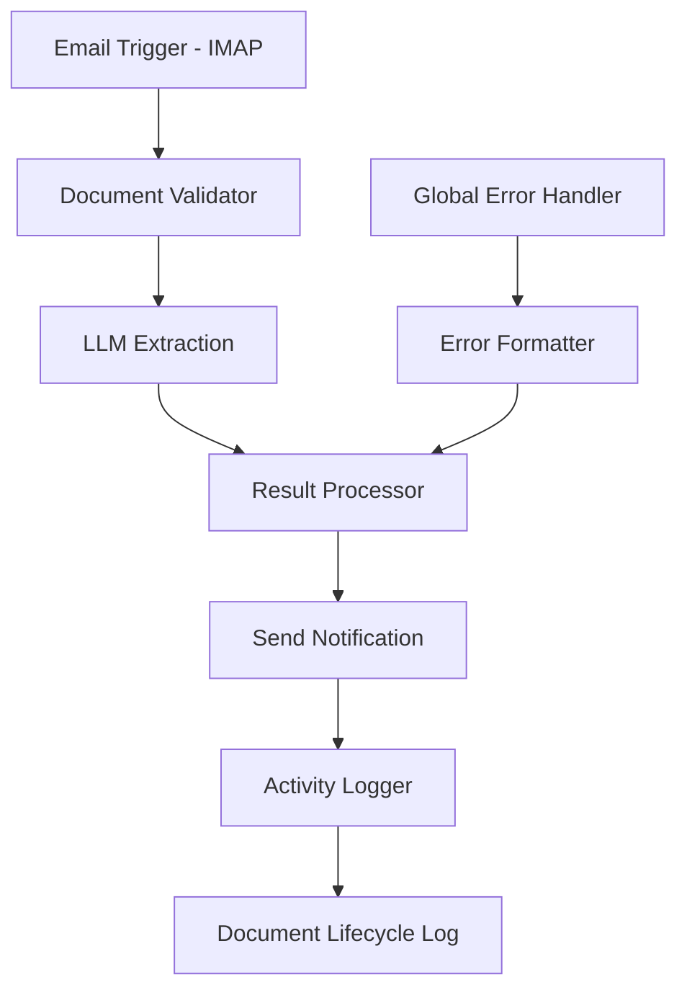

# V0 Simplified Flow – Email-based Multimodal Materials Intake System

This implementation provides an email-based document processing pipeline using n8n workflow automation and multimodal LLM capabilities for extracting materials metadata from PDF attachments, supporting both single and multiple products per document.

## Architecture Overview

```
Email (IMAP) → Document Validation → LLM Extraction → Result Processing → Email Response
```



## Key Features

- **Email-based ingestion** via IMAP monitoring
- **Direct PDF processing** with multimodal LLM
- **Multiple product extraction** from single documents
- **Visual extraction** with confidence scores and coordinates
- **Integrated confidence-based processing** with dynamic field selection
- **Comprehensive result routing** for success and error scenarios
- **Partial success support** for multi-product documents
- **Automated email responses** with extracted metadata
- **Comprehensive logging** of document lifecycle

## Script Architecture

All business logic is implemented in external JavaScript files for maintainability, version control, and testing:

### External Scripts

| Script | Purpose |
|--------|------|
| `document_validator.js` | Validates emails and extracts PDF attachments |
| `llm_extraction.js` | Uploads PDFs to LLM API and extracts metadata |
| `result_processor.js` | Consolidates results and formats email responses |
| `activity_logger.js` | Logs document lifecycle events |
| `error_formatter.js` | Formats global errors for logging |

### Script Pattern

All n8n Code nodes use a consistent pattern to load external scripts:

```javascript
const { functionName } = require('/home/node/scripts/script_name.js');
return functionName(items);
```

This approach:
- Inherits n8n's default sandbox environment
- Provides access to all JavaScript globals (Date, Promise, Buffer, etc.)
- Allows environment variable access via `process.env`
- Enables proper version control and testing
- Eliminates inline code maintenance issues

## Deployment Architecture

The system runs as a single n8n container with volume-mounted scripts and prompts:

1. **n8n Workflow Engine**: Orchestrates the entire pipeline
2. **Volume Mounts**: 
   - `/home/node/scripts`: External JavaScript files
   - `/home/node/prompts`: LLM prompt templates
   - `/home/node/specs`: Schema definitions
   - `/home/node/email_templates`: Response templates
3. **Email Integration**: IMAP for ingestion, SMTP for responses
4. **LLM API**: External service for extraction with integrated processing

## Quick Start

1. **Configure Environment**:
   ```bash
   cp env-template.txt .env
   # Edit .env with your email and LLM API credentials
   ```

2. **Deploy with Docker**:
   ```bash
   docker-compose up -d
   ```

3. **Import Workflow**:
   - Access n8n at http://localhost:5678
   - Import `workflow_Materials_Intake_V0.json`
   - Configure email credentials
   - Activate the workflow

4. **Test the System**:
   - Send an email with PDF attachment to your IMAP inbox
   - System processes and responds with extracted metadata

## System Components

### Core Files
- `docker-compose.yml`: n8n deployment configuration
- `workflow_Materials_Intake_V0.json`: n8n workflow definition with enhanced LLM Extraction node
- `scripts/document_validator.js`: Document validation function with multi-attachment support
- `scripts/result_processor.js`: Consolidated validation routing and email formatting
- `prompts/llm_extraction.txt`: LLM prompt template with integrated processing logic

### Directory Structure
```
V0_Simplified_Flow/
├── docker-compose.yml          # Docker deployment
├── .env                        # Environment configuration (created from env-template.txt)
├── data/                       # n8n data directory (auto-created by Docker)
│   └── logs/                   # Activity logs (auto-created)
├── scripts/                    # Core functions (mounted read-only)
│   ├── document_validator.js   # Document validation with multi-attachment support
│   └── result_processor.js     # Consolidated validation routing and email formatting
├── prompts/                    # LLM prompts (mounted read-only)
│   └── llm_extraction.txt      # Prompt for LLM Extraction node with integrated processing
├── email_templates/            # Email templates (mounted read-only)
│   ├── success.txt             # Success email template
│   └── failure.txt             # Failure email template
├── workflow_Materials_Intake_V0.json
├── DEPLOYMENT.md
└── env-template.txt
```

## Configuration

### Environment Variables
Configure these in your `.env` file:

```env
# Email Settings
IMAP_HOST=imap.example.com
IMAP_PORT=993
SMTP_HOST=smtp.example.com
SMTP_PORT=587
EMAIL_USER=materials@example.com
EMAIL_PASS=your-password

# LLM API Settings
LLM_API_KEY=your-api-key
LLM_API_ENDPOINT=https://generativelanguage.googleapis.com/v1beta/models/gemini-2.0-flash:generateContent
```

### Volume Mounts
The Docker setup mounts these directories into n8n:
- `./scripts:/home/node/scripts:ro` - Processing functions
- `./prompts:/home/node/prompts:ro` - LLM prompts
- `./email_templates:/home/node/email_templates:ro` - Email templates
- `../specs:/home/node/specs:ro` - Universal specs and materials schema
- `./data:/home/node/data` - n8n data and logs (directory auto-created by Docker)

## Processing Pipeline

1. **Email Trigger**: Monitors IMAP inbox for new emails
2. **Document Validator**: Validates PDF attachments and supports multi-attachment processing
3. **LLM Extraction**: Uploads PDF to Gemini Files API and extracts metadata using vision model with confidence scoring
4. **Result Processor**: Routes and formats both success and error notifications, handles multi-attachment grouping  
5. **Send Notification**: Sends results back to sender
6. **Activity Logger**: Records lifecycle events

## Confidence Policy

The system implements a three-tier confidence policy per product:
- **High (≥0.9)**: Full schema extraction
- **Mixed (0.7-0.9)**: Dynamic field selection
- **Low (<0.7)**: Rejection with explanation

For multi-product documents:
- Each product is evaluated independently
- Document succeeds if at least one product passes validation
- Partial success is supported and reported

## Development & Maintenance

### Adding New Scripts

When adding new functionality:

1. **Create external script** in `/scripts/` directory:
   ```javascript
   const myFunction = function(items) {
     // Process items
     return items;
   };
   
   module.exports = { myFunction };
   ```

2. **Add Code node** in n8n workflow:
   ```javascript
   const { myFunction } = require('/home/node/scripts/my_script.js');
   return myFunction(items);
   ```

3. **Update documentation**:
   - Add script to the table in Script Architecture section
   - Update INTERFACE_CONTRACTS.txt if adding new nodes

### Development Guidelines

- **No inline JavaScript**: All logic must be in external scripts
- **Consistent exports**: Use `module.exports = { functionName }`
- **Error handling**: Scripts should handle errors gracefully
- **Logging**: Use debug.log for troubleshooting
- **Testing**: Scripts can be unit tested outside n8n

### Environment Configuration

Required environment variables for n8n:
- `N8N_BLOCK_ENV_ACCESS_IN_NODE=false` - Allows environment variable access
- `NODE_FUNCTION_ALLOW_BUILTIN=*` - Allows all built-in modules
- `NODE_FUNCTION_ALLOW_EXTERNAL=*` - Allows all external modules

### Updating Functions
Edit files in `scripts/` directory - changes apply immediately:
- `document_validator.js`: For PDF validation logic with multi-attachment support
- `result_processor.js`: For consolidated validation routing and email formatting (both success and error scenarios)

The workflow loads these external script files and executes them using Node.js VM module, which provides better maintainability and easier version control.

### Updating Prompts
Edit files in `prompts/` directory - changes apply immediately:
- `llm_extraction.txt`: For multimodal extraction with integrated confidence-based processing

### Updating Email Templates
Edit files in `email_templates/` directory - changes apply immediately:
- `email_templates/success.txt`: Template for successful extraction emails
- `email_templates/failure.txt`: Template for error notification emails

### Modifying Workflow
1. Edit in n8n UI
2. Export workflow
3. Save to `workflow_Materials_Intake_V0.json`

## Logging & Monitoring

- **Activity Logs**: `./data/logs/document_lifecycle.json`
- **n8n Executions**: View in n8n UI
- **Docker Logs**: `docker-compose logs -f n8n`

## Email Customization

Email templates can be customized without modifying code:
- **Success Email**: Edit `email_templates/success.txt`
- **Error Email**: Edit `email_templates/failure.txt`

Templates support placeholders (e.g., `{{sender}}`, `{{productCount}}`) that are automatically replaced with actual values.

## Troubleshooting

Common issues and solutions:

- **Email not triggering**: Check IMAP credentials and server settings
- **LLM extraction failing**: Verify API key and endpoint configuration
- **No response email**: Check SMTP settings and credentials
- **Container issues**: Review Docker logs with `docker-compose logs -f`

## PROJECT_SPEC
```spec
NAME: Materials Library Extraction V0 - Email Pipeline
DOMAIN: Document Processing / Workflow Automation
PRIMARY_TOOLS: n8n, Docker, LLM APIs
PIPELINE_STAGES:
  1. Email ingestion via IMAP
  2. PDF validation
  3. PDF upload and multimodal LLM extraction with integrated confidence-based processing (single or multiple products)
  4. Result processing and email formatting (success and error routing)
  5. Email notification with all extracted products
KEY_COMPONENTS:
- `workflow_Materials_Intake_V0.json`: n8n workflow definition
- `scripts/*.js`: Individual function files for each processing node
- `prompts/llm_extraction.txt`: LLM prompt template with integrated processing
- `docker-compose.yml`: Deployment configuration
TECHNICAL_SPECIFICATIONS:
- `specs/`: Architecture and interface contracts
  - Confidence policies (V0-specific)
  - Universal specs in ../specs/ (multi-PDF, multi-product handling)
  - Materials schema for LLM API
DESIGN_CONSTRAINTS:
- Email-based ingestion only
- Functions and prompts loaded via volume mounts
- Single n8n container deployment
- Direct PDF processing without conversion
- Products always handled as arrays (even single products)
- Supports partial success for multi-product documents
- Streamlined single-LLM architecture for efficiency
```