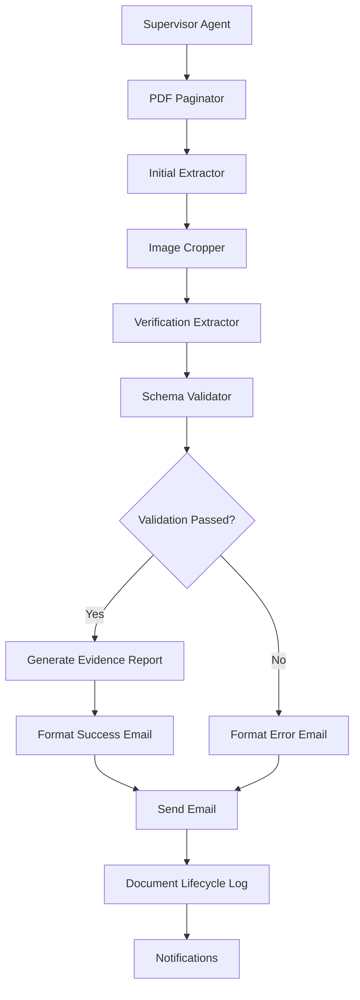

# V1.5 Enhanced Visual Verification – Intelligent Materials Intake System

This version represents a significant advancement in metadata extraction accuracy through multi-turn visual verification.

## Flow Summary

```
Supervisor → PDF Paginator → Initial Extractor → Image Cropper → Verification Extractor → Schema Validator → Response
```



## Enhanced Visual Verification Features

The extraction process has been redesigned with a multi-turn, visually-verified approach:

1. **Paginated Processing**:
   - PDF is converted to individual page images
   - Initial extraction performed on full page images
   - Coordinates recorded for each extracted field

2. **Visual Verification with Targeted Crops**:
   - Crops are generated for each field using the initial coordinates
   - Verification extractor examines each crop to confirm or correct the initial extraction
   - Confidence scores are adjusted based on verification results
   - Fields corrected when detailed view reveals different information

3. **Comprehensive Evidence Collection**:
   - Visual evidence preserved for each field
   - Confidence calculations that account for both context and detail
   - HTML evidence report generated with all extraction details

4. **Robust Schema Validation**:
   - Format and structure validation
   - Special handling for visually-verified fields
   - Confidence adjustments based on verification results

## Verification Benefits

This enhanced approach provides several key advantages:

1. **Higher Accuracy**:
   - Each field is verified twice (context and detail)
   - Auto-correction when detail view reveals more accurate information
   - Precise confidence scoring with visual evidence

2. **Clear Evidence Trail**:
   - Visual proof of extraction for each field
   - Comprehensive HTML report with all extraction details
   - Explicit tracking of corrections and confidence levels

3. **Better Failure Detection**:
   - Catches errors that text-only extraction might miss
   - Visual confirmation prevents hallucination
   - More nuanced confidence scoring

4. **Improved User Experience**:
   - Evidence report makes verification transparent
   - Higher overall accuracy reduces need for manual corrections
   - Visual confirmation adds trust to the extraction process

## Confidence Calculation

The system implements a sophisticated confidence calculation:

1. **Field-level Confidence**:
   ```
   final_confidence = context_confidence * detail_confidence * context_agreement_factor
   ```
   Where:
   - `context_confidence`: Initial extraction confidence
   - `detail_confidence`: Verification from crop examination
   - `context_agreement_factor`: 1.0 if both match, 0.8 if corrected

2. **Document-level Confidence**:
   - Average of all field confidences
   - Weighted by field importance
   - Adjusted based on schema validation

## Deployment Quick Start

1. Configure environment settings in `.env` file, including new vision model settings
2. Install dependencies (includes new image processing libraries):
   ```
   pip install pdf2image pillow
   apt-get install poppler-utils  # Required for PDF processing
   ```
3. Start the webhook handler:
   ```
   python webhook_handler.py
   ```
4. Import the enhanced workflow into n8n:
   ```
   n8n import:workflow --input=workflow_Materials_Intake_V1.5.json
   ```
5. Test the deployment:
   ```
   python testing_script.py
   ```

## System Requirements

- Python 3.8+
- poppler-utils for PDF processing
- n8n instance
- SMTP/IMAP server access
- Vision-capable LLM API access (Gemini Pro Vision, Claude 3, etc.)

## Configuration

The configuration is managed through:

1. **Environment Variables**:
   - Standard email and storage settings
   - LLM API configuration
   - New vision model endpoints

2. **Enhanced Settings**:
   - Image processing parameters (DPI, padding)
   - Confidence calculation weights
   - Evidence collection options

## Security Considerations

- All inputs are validated and sanitized
- File uploads restricted to PDFs
- Secure image processing pipeline
- Rate limiting for API endpoints
- Environment variables for sensitive credentials

## License

MIT License — see [`LICENSE.txt`](LICENSE.txt)